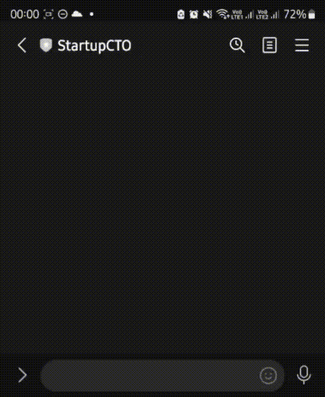
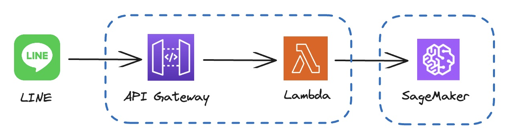

# Building GenAI Chatbot with LINE & AWS SageMaker (Falcon LLM)

> :warning: **Make sure that `ml.g5.2xlarge` instance is available in the AWS region that you are using.**


## Demo




## System Architecture



- LINE Messaging API (Nodejs)
- AWS API Gateway
- AWS Lambda (Nodejs)
- AWS SageMaker (Python)


### SageMaker

Create a SageMaker notebook [TextGeneration](sagemaker/text-generation.ipynb)

Credit: [Introduction to SageMaker JumpStart - Text Generation with Falcon models](https://github.com/aws/amazon-sagemaker-examples/blob/main/introduction_to_amazon_algorithms/jumpstart-foundation-models/text-generation-falcon.ipynb)


### Lambda

```sh
# Config
aws lambda update-function-configuration --region=us-west-2 --function-name line-messaging-api-v2 --environment Variables="{LINE_ACCESS_TOKEN=...,LINE_SECRET_KEY=...,SYSTEM_PROMPT=...}"

# Deploy & Publish
aws lambda update-function-code --region us-west-2 --function-name line-messaging-api-v2 --zip-file fileb://publish.zip --publish
```
